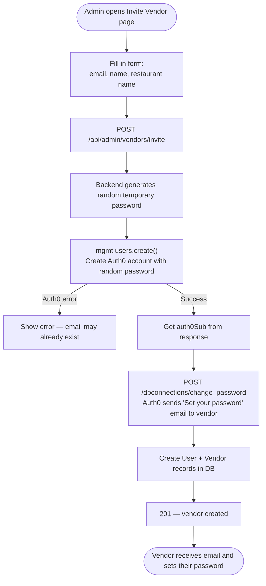
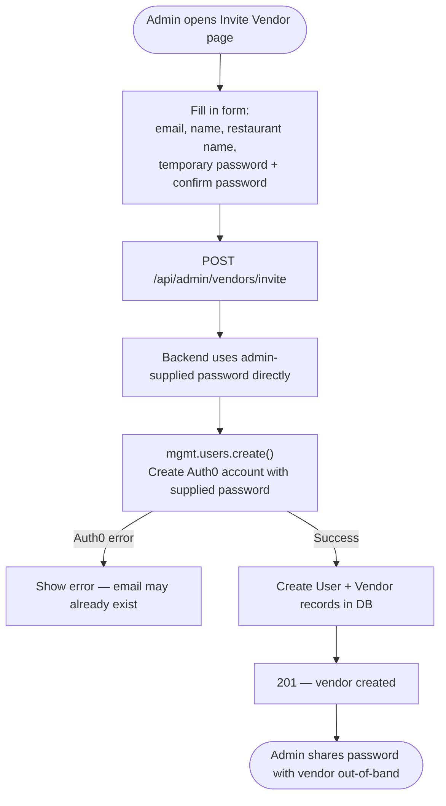
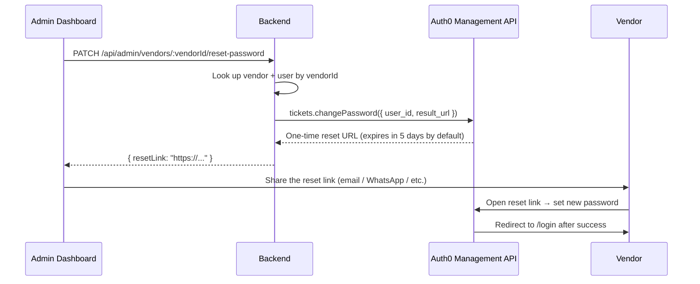
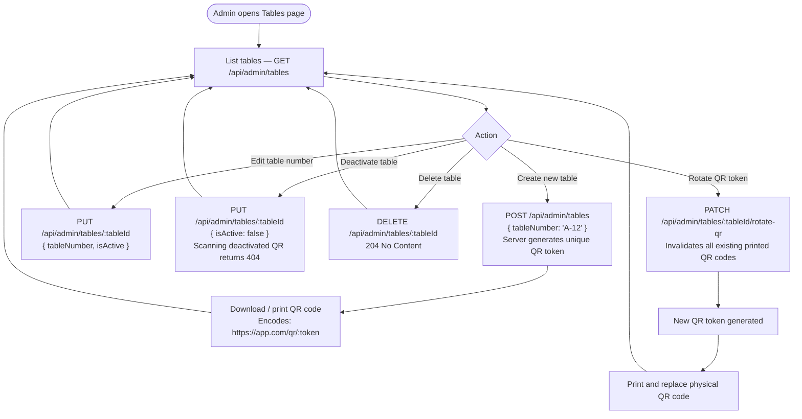
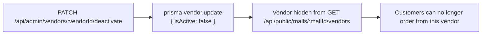

# Admin Workflow

Mall admins manage vendors and physical tables within their assigned mall. All admin routes require the `ADMIN` or `SUPER_ADMIN` role.

> An admin is scoped to exactly one mall via the `MallAdmin` join table. All queries automatically filter by `req.user.mallId`.
>
> **SUPER_ADMIN** users are also permitted on all admin routes. If a SUPER_ADMIN has no `MallAdmin` row, the backend falls back to the first mall in the database automatically (convenient for single-mall dev setups).

## Vendor Invite Flow

The recommended way to add a vendor. The flow differs depending on the `VENDOR_INVITE_DEV_MODE` feature flag.

### Production mode (`VENDOR_INVITE_DEV_MODE=false`)

### Dev mode (`VENDOR_INVITE_DEV_MODE=true`)

No email is sent. The admin sets the vendor's password directly on the invite form — useful for testing with fake email addresses without consuming Auth0 email quota.

### Feature Flag Configuration

| Environment variable               | File                           | Effect                                                  |
| ---------------------------------- | ------------------------------ | ------------------------------------------------------- |
| `VENDOR_INVITE_DEV_MODE=true`      | `food-order-dashboard-be/.env` | Backend skips change_password email, uses body password |
| `VITE_VENDOR_INVITE_DEV_MODE=true` | `food-order-v2/.env`           | Frontend shows password + confirm fields on invite form |

Both flags must be set consistently. For production, omit them or set to `false`.

### Prerequisites

The following must be configured for either invite flow to work:

- `AUTH0_MGMT_CLIENT_ID` — Client ID of the M2M app
- `AUTH0_MGMT_CLIENT_SECRET` — Client Secret of the M2M app
- The M2M app must have these Management API permissions:
  - `create:users`
  - `delete:users` (for compensating rollback on DB failure)
  - `create:user_tickets` (prod only — for reset-password)

---

## Vendor Onboard (alternative — direct with temp password)

`POST /api/admin/vendors` — an older endpoint that always takes a `temporaryPassword` in the body and creates the account immediately without sending any email. The Invite endpoint is preferred for new integrations.

---

## Password Reset Flow

When a vendor forgets their password or needs to set a new one:

---

## Table Management

### When to Rotate a QR Token

| Situation                                    | Action                              |
| -------------------------------------------- | ----------------------------------- |
| QR sticker is damaged / unreadable           | Rotate + reprint                    |
| QR code was photographed and shared publicly | Rotate immediately to prevent abuse |
| Table layout changed (new table numbers)     | Update `tableNumber` via PUT        |
| Table is temporarily out of service          | Set `isActive: false`               |
| Table is permanently removed                 | DELETE                              |

---

## Vendor Deactivation

Deactivating a vendor hides them from the customer-facing mall page. Their data is preserved — you can reactivate them by setting `isActive = true` directly in the database (there is no reactivation endpoint yet).

