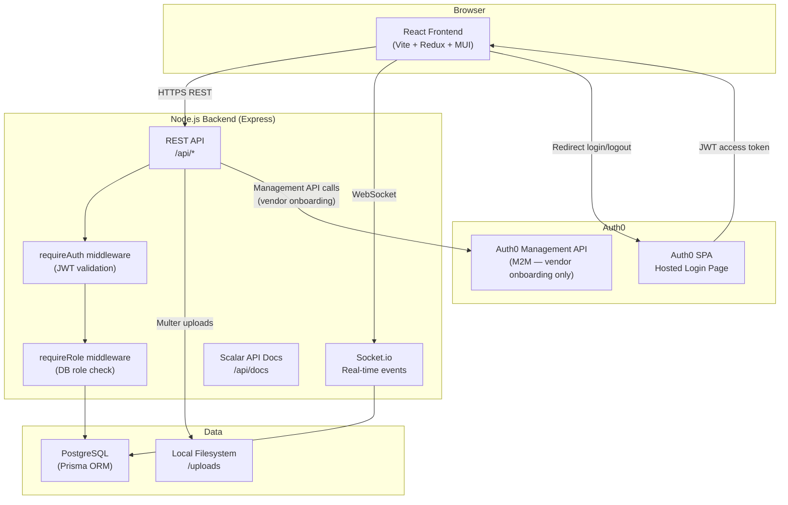
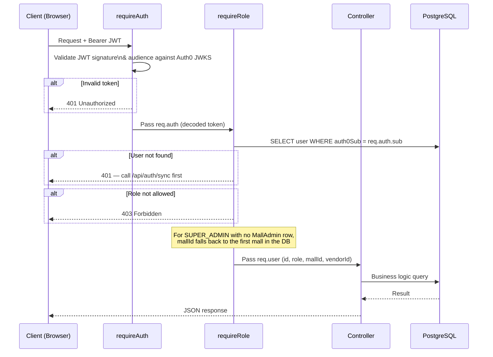
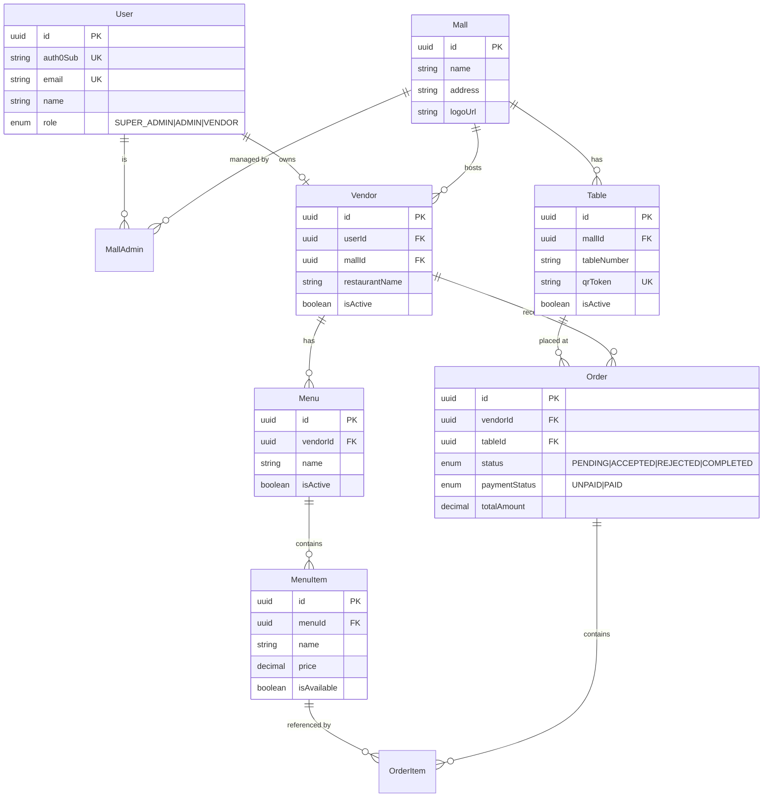
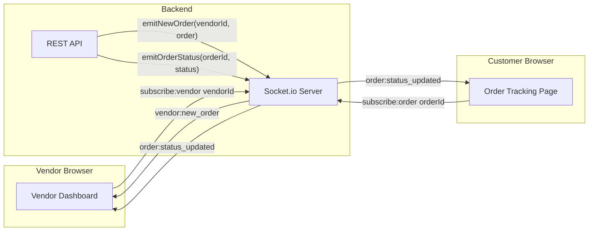

# System Architecture

## Overview

```mermaid
graph TD
    subgraph Browser
        FE["React Frontend\n(Vite + Redux + MUI)"]
    end

    subgraph Auth0
        A0["Auth0 SPA\nHosted Login Page"]
        A0M["Auth0 Management API\n(M2M — vendor onboarding only)"]
    end

    subgraph Backend ["Node.js Backend (Express)"]
        API["REST API\n/api/*"]
        WS["Socket.io\nReal-time events"]
        MW_AUTH["requireAuth middleware\n(JWT validation)"]
        MW_RBAC["requireRole middleware\n(DB role check)"]
        DOCS["Scalar API Docs\n/api/docs"]
    end

    subgraph Data
        PG["PostgreSQL\n(Prisma ORM)"]
        FS["Local Filesystem\n/uploads"]
    end

    FE -->|"HTTPS REST"| API
    FE -->|"WebSocket"| WS
    FE -->|"Redirect login/logout"| A0
    A0 -->|"JWT access token"| FE

    API --> MW_AUTH
    MW_AUTH --> MW_RBAC
    MW_RBAC --> PG

    API -->|"Multer uploads"| FS
    API -->|"Management API calls\n(vendor onboarding)"| A0M

    WS --> PG
```

## Request Lifecycle

```mermaid
sequenceDiagram
    participant C as Client (Browser)
    participant M1 as requireAuth
    participant M2 as requireRole
    participant H as Controller
    participant DB as PostgreSQL

    C->>M1: Request + Bearer JWT
    M1->>M1: Validate JWT signature\n& audience against Auth0 JWKS
    alt Invalid token
        M1-->>C: 401 Unauthorized
    end
    M1->>M2: Pass req.auth (decoded token)
    M2->>DB: SELECT user WHERE auth0Sub = req.auth.sub
    alt User not found
        M2-->>C: 401 — call /api/auth/sync first
    end
    alt Role not allowed
        M2-->>C: 403 Forbidden
    end
    Note over M2: For SUPER_ADMIN with no MallAdmin row,<br/>mallId falls back to the first mall in the DB
    M2->>H: Pass req.user (id, role, mallId, vendorId)
    H->>DB: Business logic query
    DB-->>H: Result
    H-->>C: JSON response
```

## Data Model

```mermaid
erDiagram
    Mall ||--o{ MallAdmin : "managed by"
    Mall ||--o{ Table : "has"
    Mall ||--o{ Vendor : "hosts"
    User ||--o{ MallAdmin : "is"
    User ||--o| Vendor : "owns"
    Vendor ||--o{ Menu : "has"
    Menu ||--o{ MenuItem : "contains"
    Vendor ||--o{ Order : "receives"
    Table ||--o{ Order : "placed at"
    Order ||--o{ OrderItem : "contains"
    MenuItem ||--o{ OrderItem : "referenced by"

    User {
        uuid id PK
        string auth0Sub UK
        string email UK
        string name
        enum role "SUPER_ADMIN|ADMIN|VENDOR"
    }

    Mall {
        uuid id PK
        string name
        string address
        string logoUrl
    }

    Vendor {
        uuid id PK
        uuid userId FK
        uuid mallId FK
        string restaurantName
        boolean isActive
    }

    Menu {
        uuid id PK
        uuid vendorId FK
        string name
        boolean isActive
    }

    MenuItem {
        uuid id PK
        uuid menuId FK
        string name
        decimal price
        boolean isAvailable
    }

    Order {
        uuid id PK
        uuid vendorId FK
        uuid tableId FK
        enum status "PENDING|ACCEPTED|REJECTED|COMPLETED"
        enum paymentStatus "UNPAID|PAID"
        decimal totalAmount
    }

    Table {
        uuid id PK
        uuid mallId FK
        string tableNumber
        string qrToken UK
        boolean isActive
    }
```

## Real-time Architecture (Socket.io)

```mermaid
graph LR
    subgraph Vendor Browser
        VD["Vendor Dashboard"]
    end
    subgraph Customer Browser
        OT["Order Tracking Page"]
    end
    subgraph Backend
        SIO["Socket.io Server"]
        API["REST API"]
    end

    VD -->|"subscribe:vendor vendorId"| SIO
    OT -->|"subscribe:order orderId"| SIO

    API -->|"emitNewOrder(vendorId, order)"| SIO
    SIO -->|"vendor:new_order"| VD

    API -->|"emitOrderStatus(orderId, status)"| SIO
    SIO -->|"order:status_updated"| OT
    SIO -->|"order:status_updated"| VD
```
