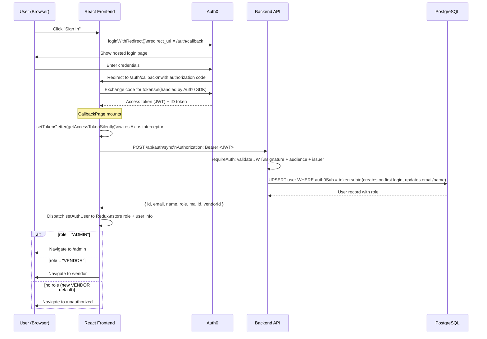
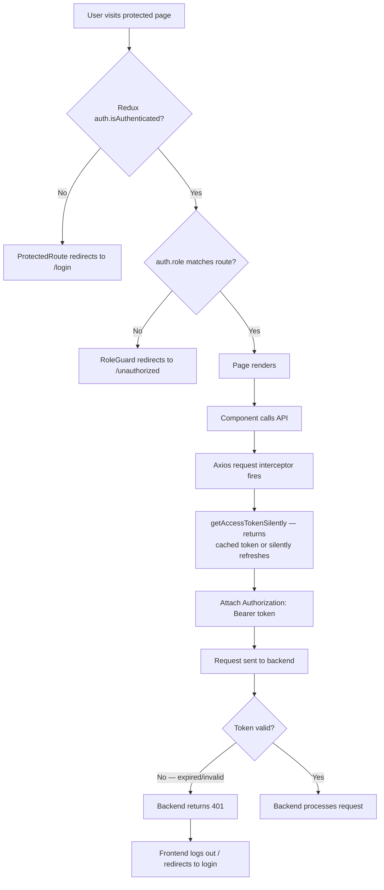
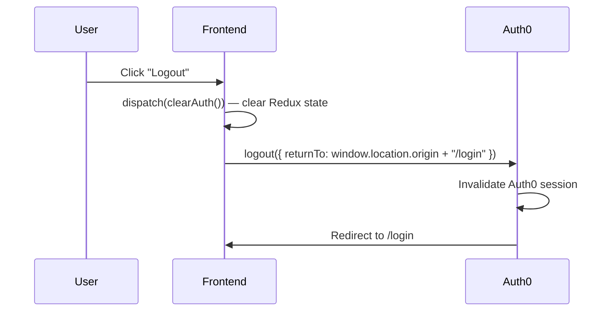

# Authentication Flow

MallBite uses Auth0 for identity. The backend validates JWTs; roles come from the database (not Auth0 claims).

## Login Flow



## Token Lifecycle



## Role Mapping

| Auth0 → DB role                  | Frontend role | Access                                  |
| -------------------------------- | ------------- | --------------------------------------- |
| `VENDOR` (default for new users) | `"vendor"`    | `/vendor/*` routes                      |
| `ADMIN`                          | `"admin"`     | `/admin/*` routes                       |
| `SUPER_ADMIN`                    | `"admin"`     | `/admin/*` routes (no dedicated UI yet) |

> **Note:** Every new user who signs up with Auth0 starts with the `VENDOR` role (Prisma schema default). To grant admin access via the API use `POST /api/super-admin/malls/:mallId/admins`. Alternatively update the DB directly:
>
> ```sql
> UPDATE users SET role = 'ADMIN' WHERE email = 'admin@example.com';
> ```

> **SUPER_ADMIN on admin routes:** `SUPER_ADMIN` users are accepted by all `/api/admin/*` endpoints (not just `/api/super-admin/*`). If they have no `MallAdmin` row the backend falls back to the first mall in the database.

## Logout Flow



> **Important:** The `returnTo` URL must be listed in the Auth0 application's **Allowed Logout URLs** setting (Auth0 Dashboard → Applications → your SPA → Settings). If it is missing, Auth0 shows an "Oops, something went wrong" error page.
>
> For local development add: `http://localhost:5173/login`

## Security Notes

- JWT validation uses Auth0's **JWKS endpoint** — signature is cryptographically verified (RS256), never just decoded
- `requireAuth` is provided by `express-oauth2-jwt-bearer` (Auth0's official library)
- `requireRole` queries the **database** for the user's role on every request — Auth0 cannot grant elevated DB permissions
- Access tokens are **never stored in localStorage** — the Auth0 SDK keeps them in memory and refreshes silently via a hidden iframe
