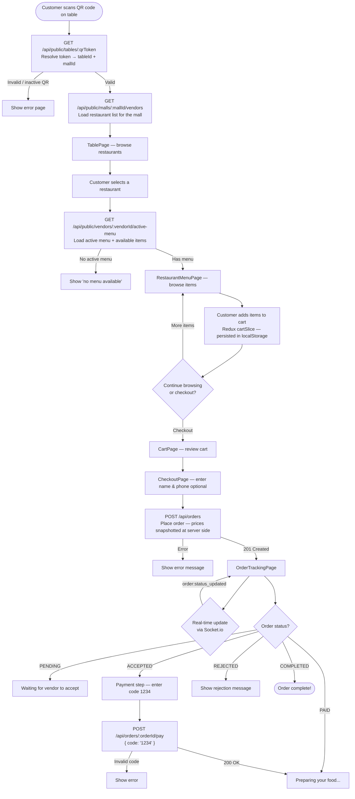
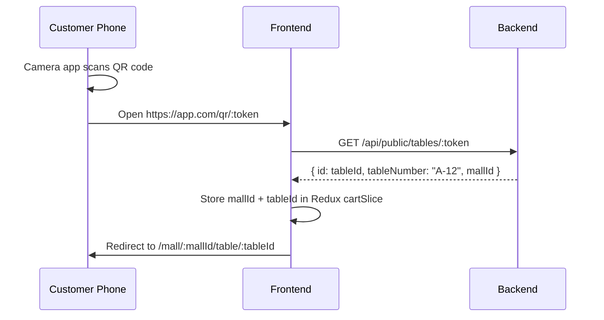
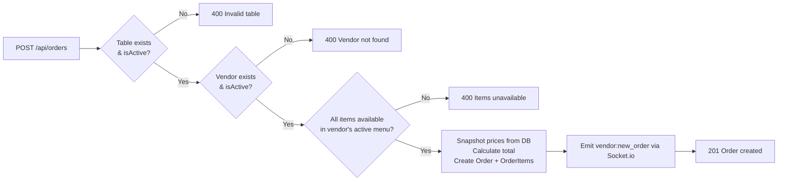

# Customer Ordering Flow

Customers are **unauthenticated** throughout the entire ordering journey. No login, no account creation required.

## End-to-End Journey

## QR Code System

Each physical table has a unique QR code. The code encodes only a short random token (not the table ID directly), which provides two benefits:

1. **Security** — table IDs are not guessable or enumerable from the QR code
2. **Rotation** — if a code is lost or damaged, the admin can rotate the token (`PATCH /api/admin/tables/:tableId/rotate-qr`) and print a new QR code, immediately invalidating the old one

## Cart Behaviour

- Cart state lives in **Redux** (`cartSlice`) and is **persisted to localStorage**
- When a customer adds an item from a **different vendor**, the cart is automatically cleared (can't mix vendors in one order)
- Cart persists across page refreshes — the customer can close the browser and return to find their cart intact
- Cart is cleared after a successful order is placed

## Order Placement Validation (Backend)

The backend validates every order strictly to prevent abuse:

> **Price snapshotting:** Prices are read from the database at order creation time, not from the client payload. A customer cannot manipulate item prices by modifying the request body.

## Payment (Dummy)

The current payment implementation is a placeholder:

- The vendor accepts the order → status becomes `ACCEPTED`
- Customer is shown a code entry field on the tracking page
- Customer enters `1234` → status becomes `PAID`
- Vendor marks order `COMPLETED` → status becomes `COMPLETED`

This is designed to be replaced with a real payment gateway (e.g. Stripe) in the future.
