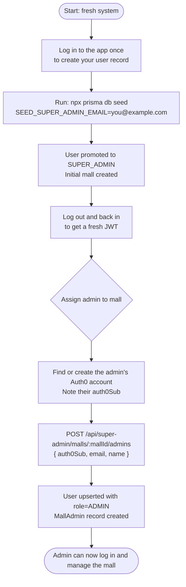
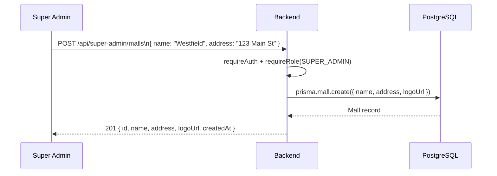
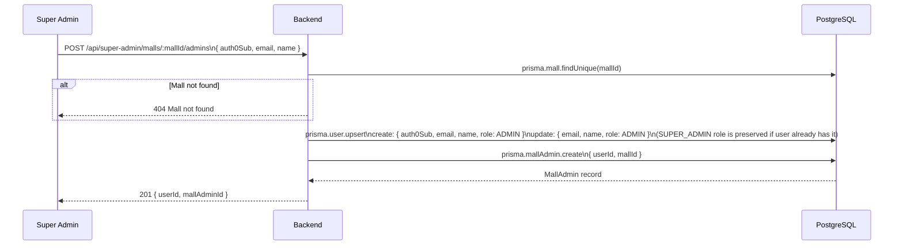

# Super Admin Workflow

The Super Admin has the highest privilege level. Their responsibilities are:

1. **Creating malls** — the top-level entity in the data model
2. **Assigning mall admins** — linking a user account to a mall with the `ADMIN` role

All super admin routes require the `SUPER_ADMIN` role.

> Currently there is no UI for super admin operations — use the API directly (via Scalar at `/api/docs`, or a tool like Postman) or run SQL directly against the database.

---

## Bootstrapping the First Super Admin

The fastest way is the built-in seed script.

### Steps

1. **Start the backend** and log in to the app at least once with your Auth0 account.  
   This triggers `POST /api/auth/sync`, which creates your user row in the database.

2. **Run the seed** from the `food-order-dashboard-be` directory (PowerShell):

   ```powershell
   $env:SEED_SUPER_ADMIN_EMAIL="you@example.com"
   $env:SEED_MALL_NAME="Grand Mall"        # optional — defaults to "Main Mall"
   $env:SEED_MALL_ADDRESS="123 Main St"    # optional — defaults to "123 Main Street"
   npx prisma db seed
   ```

   The script will:
   - Promote your user to `SUPER_ADMIN`
   - Create an initial mall (skipped if a mall with that name already exists)
   - Print the mall ID and next-step instructions

3. **Log out and log back in** — your next JWT will include the `SUPER_ADMIN` role.

> The seed is idempotent — safe to re-run without duplicating data.  
> Source: [`prisma/seed.ts`](../prisma/seed.ts)

---

## Initial System Setup (flow)



---

## Mall Creation



---

## Assigning a Mall Admin

The admin must already have signed in to Auth0 at least once (so their account exists) OR you can create their account manually in the Auth0 dashboard.



**Note:** `assignMallAdmin` checks the user's existing role before the upsert. If the user is already a `SUPER_ADMIN`, their role is not downgraded to `ADMIN`.

---

## Getting a User's Auth0 Sub

To find the `auth0Sub` for a user:

1. **Auth0 Dashboard** → Users & Roles → Users → click the user → copy the **User ID** (format: `auth0|abc123`)
2. **Or** ask the user to visit `/api/auth/sync` after logging in — their sub is stored in the `users` table as `auth0Sub`

---

## Multi-Mall Support

The data model supports multiple malls. A single super admin account can manage all malls. An admin is scoped to one mall via the `MallAdmin` join table (`@@unique([userId, mallId])`).

> Currently there is no UI support for a single admin managing multiple malls, but the data model allows it.
