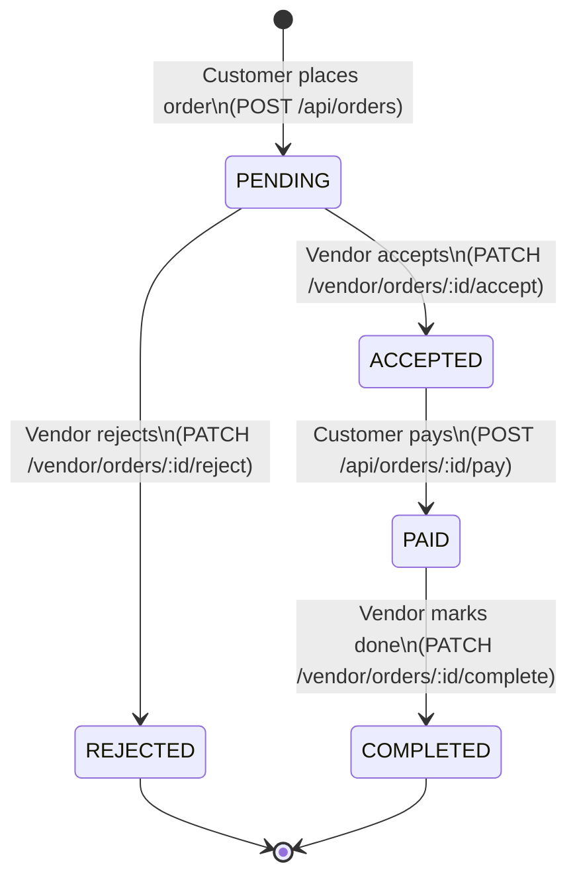
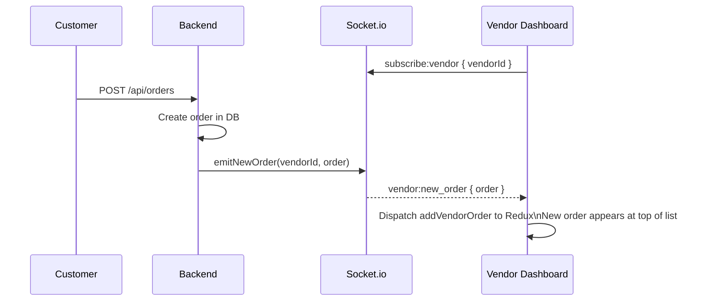
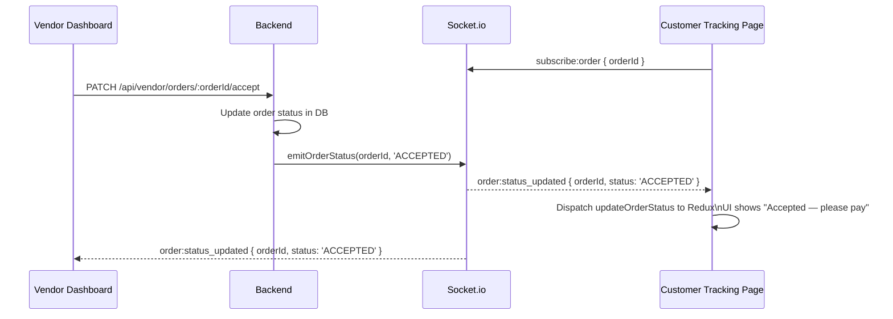

# Vendor Workflow

Vendors manage their restaurant menus and process incoming orders via the vendor dashboard. All vendor routes require authentication (`VENDOR` role).

## Menu Management

A vendor can have multiple menus (e.g. Breakfast, Lunch, Dinner) but **only one can be active at a time**. The active menu is the one customers see.

```mermaid
flowchart TD
    A([Vendor logs in]) --> B[/vendor/menus — Menus page]

    B --> C{Action}

    C -->|Create| D["POST /api/vendor/menus\n{ name }"]
    D --> B

    C -->|Rename| E["PUT /api/vendor/menus/:menuId\n{ name }"]
    E --> B

    C -->|Delete| F["DELETE /api/vendor/menus/:menuId"]
    F --> B

    C -->|Set as active| G["PATCH /api/vendor/menus/:menuId/activate\nAtomically deactivates all others"]
    G --> B

    C -->|Manage items| H[/vendor/menus/:menuId/items — Items page]

    H --> I{Item action}
    I -->|Add item| J["POST /api/vendor/menus/:menuId/items\n{ name, price, description, imageUrl }"]
    J --> H

    I -->|Upload image| K["POST /api/uploads/menu-item-image\nmultipart/form-data — returns URL"]
    K --> J

    I -->|Edit item| L["PUT /api/vendor/menu-items/:itemId"]
    L --> H

    I -->|Delete item| M["DELETE /api/vendor/menu-items/:itemId"]
    M --> H

    I -->|Toggle availability| N["PATCH /api/vendor/menu-items/:itemId/availability\nFlips isAvailable flag"]
    N --> H
```

### Menu Activation — Atomicity

When a vendor activates a menu, it uses a **Prisma transaction** to ensure consistency:

```
BEGIN TRANSACTION
  UPDATE menus SET isActive = false WHERE vendorId = :vendorId AND id != :menuId
  UPDATE menus SET isActive = true  WHERE id = :menuId
COMMIT
```

This prevents a race condition where two menus could briefly both be active.

### Item Availability Toggle

The `isAvailable` flag controls whether an item appears on the customer menu page. A vendor can hide an item temporarily (e.g. sold out) without deleting it.

---

## Order Lifecycle



## Real-time Order Notifications

When a customer places an order, the vendor is notified immediately via Socket.io — no polling required.



## Status Update — Real-time to Customer

When the vendor changes an order status, the customer's tracking page updates instantly:



## Vendor Profile

Vendors can update their restaurant profile (name, description, logo) from `/vendor/profile`. The logo is uploaded via `POST /api/uploads/menu-item-image` (the same upload endpoint is reused for both menu items and vendor logos).
